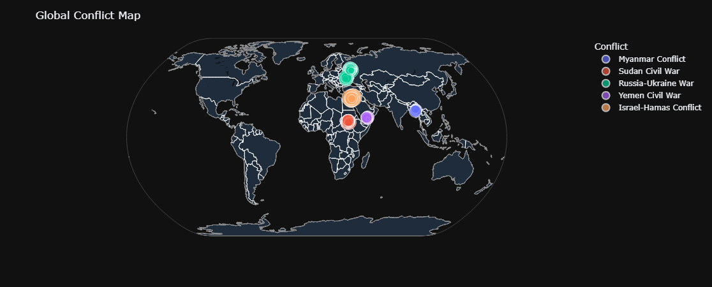
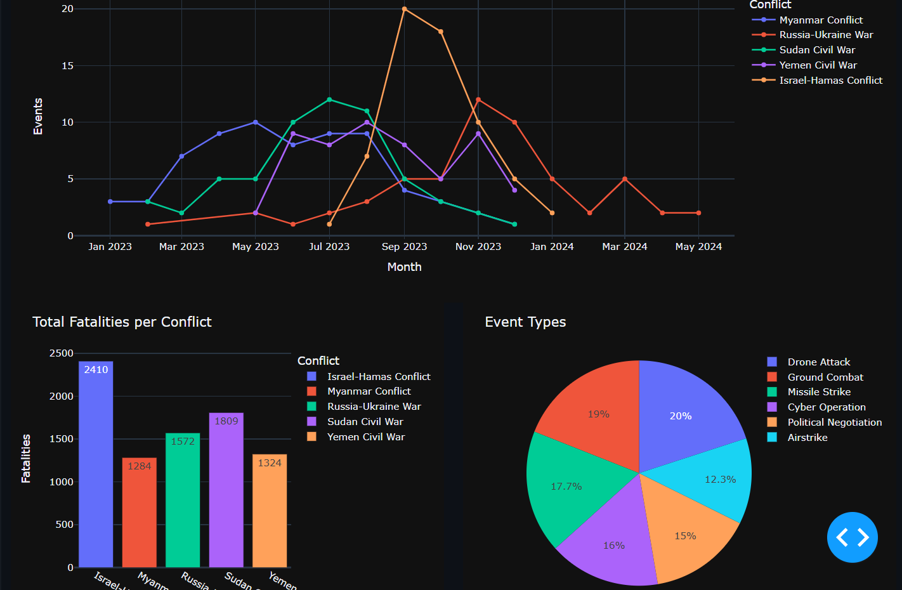
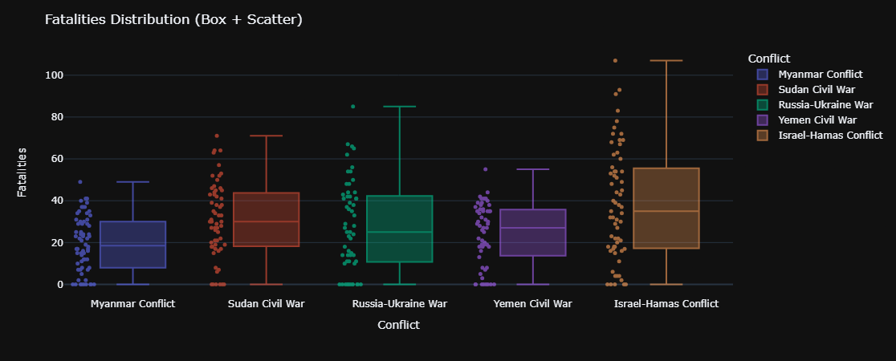
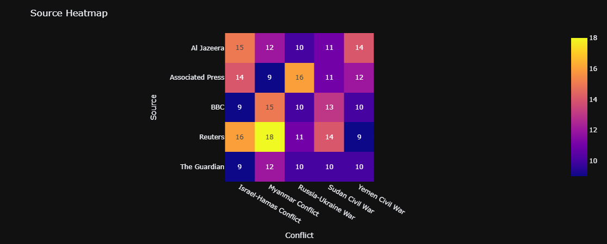

# 🌍 War Intelligence Analytics Dashboard

<div align="center">

### Interactive Geopolitical Intelligence Platform

Analyze global conflict events through geospatial intelligence, casualty analysis, event monitoring, and media coverage analytics.


</div>

# 📊 Dashboard Preview

## Global Conflict Intelligence Map

Interactive geospatial visualization of conflict events worldwide. Marker size and color represent conflict intensity and casualty magnitude, enabling rapid identification of conflict hotspots.



---

## Conflict Timeline Analysis

Monitor escalation and de-escalation trends across conflicts through temporal event analysis.



---

## Conflict Comparison Analytics

Compare conflicts based on fatalities, event frequency, and relative impact.



---

## Media Coverage Intelligence

Analyze reporting behavior across news organizations and identify coverage concentration patterns.



---

# 🚀 Project Overview

The War Intelligence Analytics Dashboard transforms raw war-event datasets into an interactive analytical platform capable of providing actionable geopolitical insights.

Modern conflict information is often fragmented across multiple news reports and regions. This dashboard centralizes conflict-event data and provides powerful visual analytics for researchers, journalists, analysts, and decision-makers.

The platform enables users to:

- Identify geographic conflict hotspots
- Monitor conflict escalation patterns
- Compare conflict severity and impact
- Analyze casualty distributions
- Study warfare tactic trends
- Evaluate media reporting behavior

---

# ✨ Core Features

### 🌍 Global Conflict Mapping
- Interactive geographic visualization
- Latitude/longitude event tracking
- Fatality-based marker sizing
- Conflict hotspot identification

### 📈 Temporal Trend Analysis
- Monthly event aggregation
- Escalation detection
- Historical conflict tracking
- Dynamic filtering

### ⚔️ Conflict Comparison
- Fatality analysis
- Event volume comparison
- Relative conflict intensity measurement

### 📊 Event-Type Analytics
- Warfare tactic distribution
- Combat pattern identification
- Conflict-specific event analysis

### ☠️ Fatality Impact Assessment
- Casualty distribution visualization
- Outlier detection
- High-impact event identification

### 📰 Media Intelligence
- News-source analysis
- Reporting concentration patterns
- Source-conflict relationships

---

# 🎛 Interactive Controls

The dashboard supports synchronized filtering across all visualizations.

| Filter | Purpose |
|----------|----------|
| Conflict | Analyze individual conflicts |
| Event Type | Explore warfare tactics |
| Date Range | Study temporal trends |
| Country | Geographic analysis |
| News Source | Media intelligence |

All dashboard components update dynamically using Dash callback architecture.

---

# 🏗 Technology Stack

## Backend

- Python
- Pandas
- NumPy

## Dashboard Framework

- Dash
- JupyterDash

## Visualization

- Plotly Express
- Plotly Graph Objects

## Data Analytics

- Data Cleaning
- Feature Engineering
- Exploratory Data Analysis
- Geospatial Analytics

---

# 📂 Project Structure

```text
War-Intelligence-Analytics-Dashboard
│
├── notebook.ipynb
├── dataset.csv
│
├── screenshots
│   ├── map.png
│   ├── timeline.png
│   ├── scatter.png
│   ├── heatmap.png
│   └── demo.mp4
│
└── README.md
````

---

# 📈 Skills Demonstrated

* Data Visualization
* Interactive Dashboard Development
* Business Intelligence
* Exploratory Data Analysis (EDA)
* Geospatial Analytics
* Data Cleaning & Transformation
* Python Application Development
* Dashboard UI/UX Design

---

# 🔮 Future Improvements

* Real-time News API Integration
* Predictive Conflict Forecasting
* Machine Learning Trend Analysis
* Sentiment Analysis
* Cloud Deployment
* User Authentication

---

# 👨‍💻 Author

**Adi Kashyap**

GitHub: [https://github.com/Astro-Phile](https://github.com/Astro-Phile)


